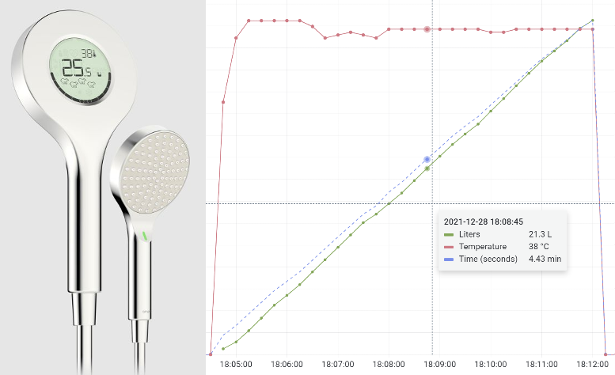

# Hub application for Amphiro/Oras Digital shower head

This application is reading your Amphiro/Oras Digital Shower head for **water consumption**, **water flow(l/min)** , **water temperature** and **shower length**. That data can be sent forward as MQTT or written into a file.

You can point MQTT messages to your favorite datalogging service for storage and visualization.

I'm running this in small Raspberry PI Zero, but any Bluetooth enabled Linux should work.



# Quick setup
- run `./check_and_install_prerequisites.sh` to install all needed libraries
- run `sudo python3 find_my_shower.py` to find out showers mac address
- add showers mac address into **config.ini** 
- run `./read_Ampiro_shower.sh` to start collecting data from your shower


# Longer setup with explanations :) 

## Installation and configuration

- Clone this GIT repository
- Find your showers mac address by running `sudo python3 find_my_shower.py`
   -  Or you can get the mac address from shower mobile app.
- Add your shower heads MAC Adress into **config.ini** file.
- Edit your MQTT credentials into **config.ini** file.
- Enable/disable file logging and MQTT from **config.ini** file.

## Prerequisites and libraries needed

You can just run helper script that will check and install all the required libraries.
`./check_and_install_prerequisites.sh`

Or do the same thing manually:

- You need to have **Python3** installed
  - Install with `sudo apt-get install python3` in rasbian.
- make sure following python libraries are installed:
  - **paho-mqtt**  (Install with: `pip3 install paho-mqtt`)
  - **bluepy** (Install with: `pip3 install bluepy`)


## Running this application

Run the following command:
_(Script assumes this GIT is cloned to /home/pi/ )_
```
./read_Ampiro_shower.sh
```
- Application will start searching for the shower head.
- When water is turned on this application will connect into the shower head and start streaming data from it.
- When  water is turned off, shower  turns off the bluetooth and application disconnects. Application switches back to searching for the shower head to turn on again.

## Running this application automatically
You should make sure this application is always running by placing it into cron.

In Ubuntu/rasbian it's easily done by adding the following line into your crontab.
```
@reboot sleep 20 && /home/pi/amphiro_oras_bluetooth_shower_hub/read_Ampiro_shower.sh
```
This will make sure that application is executed 20 seconds after reboot. (20 sec delay to make sure all the services are up and running.)

# Roadmap

Ideas to be implemented in the future:
- Calculate your cumulated daily water consumption and add it into outgoing MQTT-messages

# License
This application is licensed under **[Apache License 2.0](https://choosealicense.com/licenses/apache-2.0/)**

----

# Protocol description of Amphiro / Oras bluetooth shower
This Protocol section is intended for developers. If you are just using this application, no need to read or understand this :) .

Shower is exposing standard BLE interface accessible freely with any BLE application.

## UUID's
There are several plain text UUID's exposed by the device.
Here are the most interesting ones:

| name    | UUID          | Example value | Explanation |
| ------- | ------------- | ------------- | ----------- |
| name    | 00002a29-0000-1000-8000-00805f9b34fb  | "Amphiro"  | Plain text value of the manufacturer |
| version | 00002a26-0000-1000-8000-00805f9b34fb  | "13.2"     | Version number of the software       |
| **status**  | 7f402203-504f-4c41-5261-6d706869726f  | HEX-value  | Binary blob. This status field contain most of the interesting info |
| **flow**    | 7f40c00f-504f-4c41-5261-6d706869726f | HEX-value   | Binary blob. Water flow is encoded into this data blob.

### status field ###
**Status field**  contains **single binary data blob** that seems to contain most of the interesting values encoded into it.

In this example *Status-field* value is presented in HEX.
When UUID was read value "000014004e060048002b2410000319410000" was returned.

#### Binary data explained ####
| Status Example   |                |          |    |       |        |             |        |             |              |
| ---------------- | -------------- | -------- | -- | ----- | ------ | ----------- | ------ | ----------- | ------------ |
| Example hex data | 000014         | 004e     | 06 | 0048  | 002b24 | 10          | 0003   | 19          | 410000       |
| Length/encoding  | 3 bytes        | 2 bytes  | 1 byte | 2 bytes  | 3 bytes | 1 byte          | 2 bytes   | 1 byte          | 3 bytes       |
| Explanation      | SessionCounter | timeA | A  | timeB | Pulses | Temperature | kWatts | B (static?) | C (Static ?) |
|                  | Field is increasing number of how many times shower is turned on. If you turn shower off and back on, then this counter is not increased. So it tries to follow how many showers has been taken. | Shower time in seconds. | Fields purpose unknown. Value seems to start from 0 or 1. Then sometimes increase up to 6. | This value is almost the same as TimeA, but sometimes a bit lower. Might indicate the time of actual water flowing. | Pulse counter how much water is used. **Divide this value with 2560** and you get liters consumed  | Temperature in Celcius degrees. Doesn't have decimals. | **Divide this value with 100** and you get kW value calculated by the shower.  | unknown. Seems to be static "0x19"  | unknown. Seems to be static "0x410000" |

### flow field ###
**flow field**  contains **single binary data blob** that seems to have water flow value encoded into it.

In this example value is presented in HEX. When UUID was read value "0382 fc0c 0f4d 0557 00" was returned.

#### Binary data explained ####
| Flow Example     |              |         |         |         |        | 
| ---------------- | ------------ | ------- | ------- | ------- | ------ | 
| Example hex data | 0382         | fc0c    | 0f4d    | 0557    | 00     |
| Length/encoding  | 2 bytes      | 2 bytes | 2 bytes | 2 bytes | 1 byte |
| Explanation      | D            | E       | flow    | flowB   | F      |
|                  | Unknown. Seems to be static '0x0382' | Unknown. Seems to be static '0xfc0c' | Divide this with 1220 to bet water flow (liters/minute). | Unknown. Seems to increase as the water flows, but is not linear to water flow. | Unknown. Seems to be static '0x00'  |


